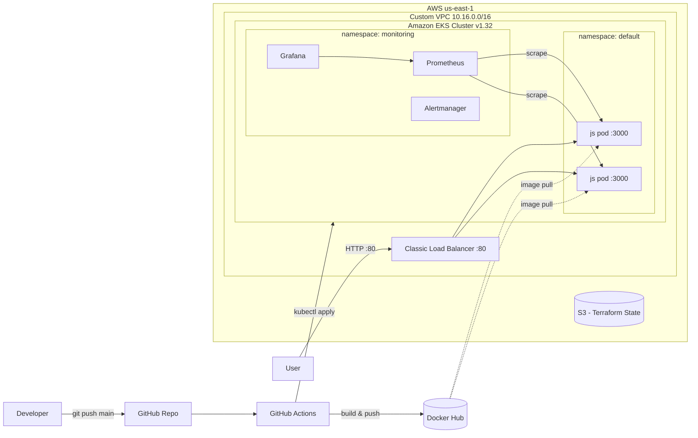

# Dock-Git-Kube

**End-to-end container delivery on AWS: Node.js → Docker → GitHub Actions → Amazon EKS (Terraform) → Prometheus & Grafana**

[](https://github.com/FaboCloudsurf/js-docker-kube/actions/workflows/pipeline.yml)
[](https://hub.docker.com/r/devfabro83/js-docker-app)


---

## Overview

This project takes a Node.js/Express application from source code to a monitored, production-style Kubernetes deployment on AWS with no manual deploy steps.

A push to `main` triggers a GitHub Actions pipeline that builds the Docker image, pushes it to Docker Hub, authenticates to AWS, and applies the Kubernetes manifests to an Amazon EKS cluster. The cluster and its networking are provisioned entirely with Terraform, with remote state in S3. Cluster health is monitored with Prometheus and Grafana, installed through Helm.

**What this project demonstrates**

- Containerizing an application with a cache-efficient, slim Docker image
- Building a CI/CD pipeline with GitHub Actions and encrypted secrets
- Provisioning EKS, VPC networking, and IAM with Terraform (Infrastructure as Code)
- Managing Terraform state remotely in S3 with native state locking
- Deploying workloads with Kubernetes Deployments and a LoadBalancer Service
- Setting up cluster observability with the `kube-prometheus-stack` Helm chart
- Tearing down every resource cleanly to control cost

---

## Architecture



---

## Tech Stack

| Layer | Technology | Purpose |
|---|---|---|
| Application | Node.js, Express | Lightweight web server on port 3000 |
| Containerization | Docker (`node:18-slim`) | Portable, reproducible runtime image |
| Registry | Docker Hub | Stores the application image |
| CI/CD | GitHub Actions | Automated build, push, and deploy on every push to `main` |
| Infrastructure as Code | Terraform | Provisions VPC, subnets, IAM, EKS, and node group |
| State Management | Amazon S3 | Remote Terraform state with `use_lockfile` locking |
| Orchestration | Amazon EKS (Kubernetes 1.32) | Managed control plane with a managed node group |
| Compute | EC2 `t3.medium` (x2) | Worker nodes across two Availability Zones |
| Access Control | AWS IAM, EKS Access Entries | Cluster and node roles; API-mode cluster authentication |
| Package Management | Helm | Installs the monitoring stack |
| Monitoring | Prometheus, Alertmanager | Metrics collection and alert routing |
| Visualization | Grafana | Pre-built Kubernetes dashboards |

---

## Repository Structure

```
js-docker-kube/
├── .github/
│   └── workflows/
│       └── pipeline.yml      # CI/CD pipeline
├── terraform/
│   ├── auth.tf               # AWS provider configuration
│   ├── network.tf            # VPC, public subnets, IGW, route table
│   ├── iam.tf                # EKS cluster & node IAM roles and policies
│   ├── eks.tf                # EKS control plane
│   ├── eks_nodes.tf          # Managed node group
│   ├── eks_access.tf         # Cluster admin access entry
│   ├── sg.tf                 # Security group
│   ├── key.tf                # EC2 key pair lookup
│   ├── s3.tf                 # Remote state backend
│   ├── variables.tf          # Input variables
│   └── outputs.tf            # Cluster name and endpoint
├── Dockerfile
├── deployment.yaml           # Kubernetes Deployment (2 replicas)
├── service.yaml              # Kubernetes LoadBalancer Service
├── index.js                  # Express application
├── package.json
└── package-lock.json
```

---

## CI/CD Pipeline

Every push to `main` runs the workflow in `.github/workflows/pipeline.yml`:

| # | Step | Action / Command |
|---|---|---|
| 1 | Checkout code | `actions/checkout` |
| 2 | Log in to Docker Hub | `docker/login-action` using `DOCKERHUB_USERNAME` / `DOCKERHUB_TOKEN` secrets |
| 3 | Build and push image | `docker/build-push-action` → `devfabro83/js-docker-app` |
| 4 | Configure AWS credentials | `aws-actions/configure-aws-credentials` |
| 5 | Update kubeconfig | `aws eks update-kubeconfig` |
| 6 | Deploy to EKS | `kubectl apply -f deployment.yaml -f service.yaml` |

**Pipeline run time:** ~39 seconds from push to deployment.

**Required repository secrets**

| Secret | Description |
|---|---|
| `DOCKERHUB_USERNAME` | Docker Hub username |
| `DOCKERHUB_TOKEN` | Docker Hub personal access token |
| `AWS_ACCESS_KEY_ID` | IAM user access key |
| `AWS_SECRET_ACCESS_KEY` | IAM user secret key |
| `AWS_REGION` | Target region (`us-east-1`) |

---

## Infrastructure (Terraform)

| Resource | Configuration |
|---|---|
| VPC | `10.16.0.0/16` with DNS support and hostnames enabled |
| Subnets | Two public subnets: `10.16.32.0/20` (us-east-1a), `10.16.48.0/20` (us-east-1b) |
| Routing | Internet Gateway with a default route, associated to both subnets |
| EKS Cluster | Kubernetes 1.32, `authentication_mode = "API"` |
| Node Group | `t3.medium`, desired 2 / min 1 / max 3, `max_unavailable = 1` |
| IAM | `AmazonEKSClusterPolicy`, `AmazonEKSWorkerNodePolicy`, `AmazonEKS_CNI_Policy`, `AmazonEC2ContainerRegistryReadOnly` |
| State | S3 backend with native lockfile (`use_lockfile = true`) |

`depends_on` ensures IAM policy attachments exist before the cluster and node group are created, and are destroyed only after them, so EKS can clean up its managed ENIs and security groups.

---

## Kubernetes

- **Deployment** `js-deployment` runs **2 replicas** of `devfabro83/js-docker-app` on container port `3000`.
- **Service** `js-service` (type `LoadBalancer`) provisions an AWS Classic Load Balancer and routes **port 80 → 3000** to pods labeled `app: js`.

---

## Monitoring

The `kube-prometheus-stack` Helm chart is installed into a dedicated `monitoring` namespace:

| Component | Role |
|---|---|
| Prometheus | Scrapes and stores cluster metrics as time series |
| Prometheus Operator | Manages Prometheus and Alertmanager through custom resources |
| Alertmanager | Routes alerts to email, Slack, or PagerDuty once receivers are configured |
| kube-state-metrics | Exposes object state: deployments, replicas, pod phase |
| node-exporter | DaemonSet collecting node-level CPU, memory, disk, and network metrics |
| Grafana | Pre-built dashboards for cluster, namespace, pod, networking, and etcd |

**Observed cluster snapshot** (Kubernetes / Compute Resources / Cluster dashboard)

| Metric | Value |
|---|---|
| CPU utilisation | 2.47% |
| Memory utilisation | 28.9% |
| Pods monitored | 17 across `default`, `kube-system`, and `monitoring` |

---

## Getting Started

### Prerequisites

- Node.js and npm
- Docker
- Terraform
- AWS CLI configured with an IAM user
- kubectl
- Helm

### 1. Run locally

```bash
npm install
node index.js
# http://localhost:3000
```

### 2. Build and run the container

```bash
docker build -t devfabro83/js-docker-app:latest .
docker run -d -p 3000:3000 --name js-app devfabro83/js-docker-app:latest
```

### 3. Provision the infrastructure

```bash
cd terraform
terraform init
terraform plan
terraform apply
```

### 4. Connect kubectl and deploy

```bash
aws eks update-kubeconfig --region us-east-1 --name <cluster-name>
kubectl get nodes
kubectl apply -f deployment.yaml
kubectl apply -f service.yaml
kubectl get services   # copy the EXTERNAL-IP of js-service
```

### 5. Install monitoring

```bash
helm repo add prometheus-community https://prometheus-community.github.io/helm-charts
helm repo update
helm install monitoring prometheus-community/kube-prometheus-stack \
  --namespace monitoring --create-namespace

# Grafana admin password
kubectl get secret --namespace monitoring monitoring-grafana \
  -o jsonpath="{.data.admin-password}" | base64 --decode ; echo

# Access Grafana at http://localhost:3000
kubectl --namespace monitoring port-forward svc/monitoring-grafana 3000:80
```

---

## Teardown

Delete the LoadBalancer Services first so AWS removes the load balancers and their ENIs, then destroy the infrastructure:

```bash
kubectl delete service js-service
cd terraform
terraform destroy
```

---

## Known Limitations & Roadmap

- **Image tagging:** images are tagged `latest`. Next step: tag with the commit SHA so every deploy triggers a rolling update and can be rolled back.
- **AWS authentication:** the pipeline uses long-lived IAM access keys. Next step: GitHub OIDC with an assumable IAM role.
- **Testing:** add unit tests and a test stage that gates the build.
- **Autoscaling:** add Cluster Autoscaler or Karpenter so the node group scales on demand.
- **Networking:** move worker nodes to private subnets behind a NAT gateway.
- **Workload hardening:** add resource requests/limits, liveness/readiness probes, and a non-root container user.
- **Base image:** upgrade from Node 18 (end-of-life) to a current LTS release.
- **Alerting:** configure Alertmanager receivers (Slack/email) for key alerts.

---

## Author

**Fabian Brown** — AWS Cloud & DevOps Engineer

[](https://github.com/FaboCloudsurf)
